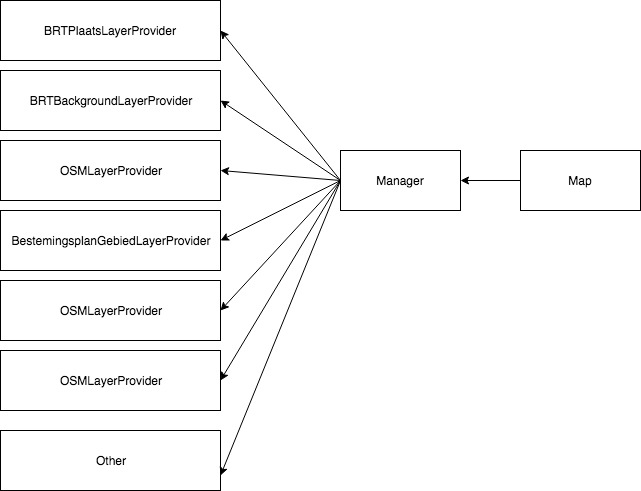

# Gebiedsscan applicatie
Since the retrieved data not always comes in the same format, it is a best practice to format it into a single unified data structure. Therefore, throughout the application, as a standard rule we only use leaflet layers. Any data source, (WMS features, JSON, GEOJSON and others) will be converted to a [Leaflet GeoJson Layer](https://leafletjs.com/reference-1.3.0.html#geojson). 

## GeoDataManager
The GeoDataManager module, is a "framework agnostic" set of classes that help with the distributing of the logic and the retrieval of data from the different data sources.

```
let data = {Some GeoJson};
L.geoJSON(data);
```

Every L.geoJSON instance is formated and declared with its respective event handlers. This allow us to interact with each of the datasources in a standarized way, and help us answer questions such as:

* Retrieve all the results within a certain polygon.
* Retrieve all the results intersecting a point.
* etc...



In the above diagram you will find 3 main modules the **Map**, the **Manager** and each of the layer providers that we are going to call **Providers**.

### Manager
The **Manager** class takes care of retrieving the data, adding and removing layers to the map, registering the different event handlers for each of the layers, filtering layers based on user interaction among other low level tasks that facilitate the development of the application. 

### Providers
The **Providers** are a set of files following the following convention: DataSourceName + LayerProvider.js. E.g. "BestemingsplanGebiedLayerProivder.js". Each layer provider specifies how the manager will retrieve, format and render the data on the map. Therefore, you will find methods such as: getUnderPoint(geojsonPoint) or getUnderPolygon(geojsonPoint). That will specify how to get a feature under the given geometry, for a WMS layer we need to make a different api than to a sparql endpoint, and so on. 

### Map
The **Map** module is just a VueJs component that creates an instance of the manager and initializes the Leaflet Map instance. 
In the map component is where we hook the map events with the manager event handlers.

### Example
In the following example we illustrate what are the underlying steps on one of the use cases, which is, retrieving features under a geometry. 


## How to add a new data source?

Adding a new data source is pretty straight forward, Just create the layer provider javascript file from the example and modify to fit the requirements, then, import and declare created class in the manager file. Lastly, indicate the manager to add layer to the mapp.

#### 1. Create Layer Provider

``` javascript
import LayerProvider from "../LayerProvider";
import axios from "axios";

export default class extends LayerProvider {

    constructor(manager) {
        super(manager);
        this.name = 'Bag';
        this.type = this.TYPE.TILES;
        this.zIndex = 10;

        //legend used in the UI
        this.legend = { 
            pand: {
                'backgroundColor': '#cccccc',
                'border': '2px solid black'
            }
        }
    }

    render() {
        this.visible = true;
        this.layer = L.tileLayer.wms('https://geodata.nationaalgeoregister.nl/bag/wms', {
            layers: 'pand',
            format: 'image/png',
            transparent: true
        });
        return this.layer;
    }


    //Specify how to get features under a point
    getUnderPoint(point) {
        return new Promise(resolve => {
            axios.post('https://bag.basisregistraties.overheid.nl/api/v1/panden', {
                'geometrie': {
                    'contains': {'type': 'Point', 'coordinates': point}
                }
            }, {
                headers: {
                    'Accept': 'application/hal+json',
                    'Content-Type': 'application/json',
                    'X-Api-Key': '7753828d-ece2-457e-8ac7-9bfd5b208ee4'
                }
            }).then(({data}) => {                
                if (data._embedded.panden.length) {
                    let geojson = {
                        "type": "Feature",
                        "geometry": data._embedded.panden[0]._embedded.geometrie,
                        "properties": data._embedded.panden[0]
                    }
                    let layer = L.geoJson(geojson);
                    
                    let style = {
                        stroke: false,
                        fill: true,
                        fillOpacity: 0.6
                    };
                    layer.setStyle(style);
                    
                    resolve({
                        source: this.name,
                        label: 'Pand',
                        layer: layer,
                        data: data._embedded.panden
                    })
                }
                else {
                    resolve({});
                }
            });
        });
    }

    //Specify how to get features under a polygon
    getUnderPolygon(polygon) {
        return new Promise(resolve => {
            axios.post('https://bag.basisregistraties.overheid.nl/api/v1/panden', {
                'geometrie': {
                    'within': polygon
                }
            }, {
                headers: {
                    'Accept': 'application/hal+json',
                    'Content-Type': 'application/json',
                    'X-Api-Key': '7753828d-ece2-457e-8ac7-9bfd5b208ee4'
                }
            }).then(({data}) => {
                if (data._embedded.panden.length) {
                    let geojson = {
                        type: "FeatureCollection",
                        features: data._embedded.panden.map((item) => {
                            let feature = {
                                "type": "Feature",
                                "geometry": item._embedded.geometrie,
                                "properties": item
                            }
                            return feature;
                        })
                    }

                    let style = {
                        stroke: false,
                        fill: true,
                        color: "#00b703",
                        fillOpacity: 0.6
                    };

                    let layer = L.geoJson(geojson, {style: style});
                    
                    resolve({
                        source: this.name,
                        label: 'Panden',
                        layer: layer,
                        data: data._embedded.panden
                    })
                }
                else {
                    resolve({});
                }
            });
        });
    }

    //Specify what to return when layer is clicked.
    clickEvent(event) {
        return event.latlng;
    }
}


```

#### 2. Declare layer in manager

In the Manager.js file add in the **providerClasses** array, the instance of the provider that has been created.

```
import BagLayerProivder from "./Providers/BagLayerProivder";

this.providerClasses = [
    BagLayerProivder,
    BestemingsplanGebiedLayerProvider,
    BRKLayerProivder
]
```
#### 3. Indicate manager to add layer to map

In the HTML:
```

<BaseMap :bounds="bounds"
    :params="params"
    @managerSetup="managerSetup"
    @BRTBackgroundClick="mapClicked"
</BaseMap>

```
In the controller: 
```
{
    //vue js data property
    {
        data() {
            return {
                params: {
                    query: {},
                    layers: {
                        Bestemmingsplangebied: false
                    },
                    options: {
                        flyToBoundsAnimated: false
                    }
                }
            }
        },
        methods() {
            managerSetup(managerReference) {
                this.manager = managerReference;

                this.manager.add([
                    "Bag" //Add the bag layer to the map
                ]);
            },
            mapClicked() {
                //do something when user clicks on the map
            }
        }
    }
}
```

