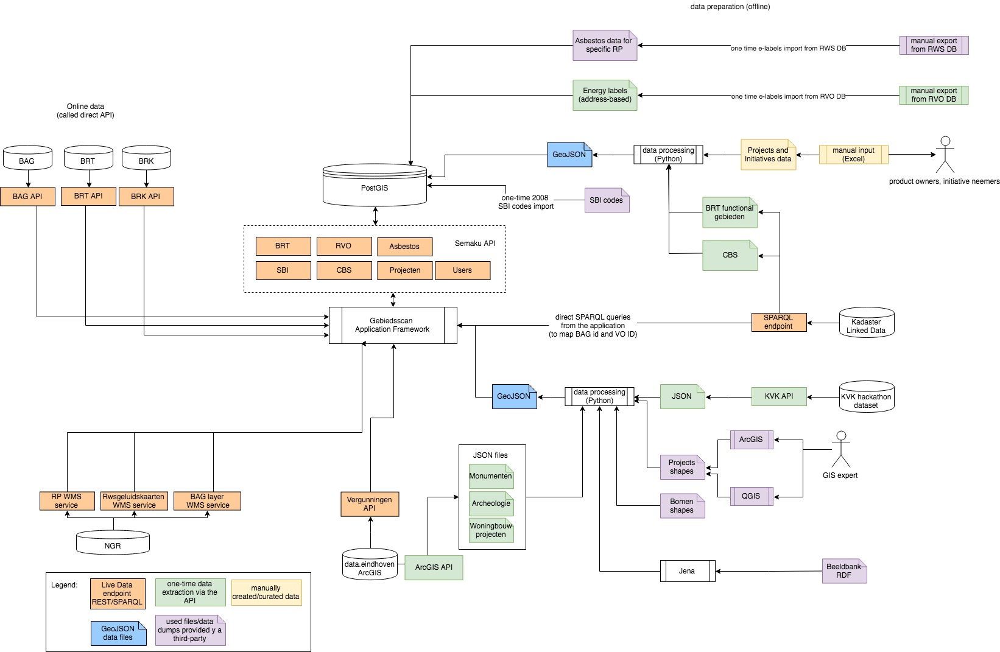

# Introductie
In het kader van het Digitale Stelsel Omgevingswet stelt de Gebiedsscan applicatie  data beschikbaar voor gebiedsontwikkeldoeleinden. De verschillende databronnen worden op de kaart aan elkaar  gekoppeld waarmee meer informatie wordt gegeven voor het gegeven doel. De applicatie helpt het Kadaster en gemeenten in het kader van gebiedsontwikkeling, bepalen van een geschikte vestigingslokatie en helpt met de voorsortering tbv vergunningaanvraag.

De applicatie beschikt over datasets zoals o.a. die van de Kamer van Koophandel en van enkele Landelijke voorzieningen zoals die van de BAG, BRT, Ruimtelijk Plannen, etc… Deze datasets zijn wijdverspreid en niet op een zingevende manier met elkaar in relatie gebracht. Deze applicatie tracht binnen gegeven doel de data op een gebruiksvriendelijke zinvolle manier aan elkaar gekoppeld te representeren.

Datasets worden middels gemeenschappelijke data types waaronder bijvoorbeeld coördinaten - met elkaar in relatie gebracht. Om de applicatie op een effectieve manier te bedienen is er een "slimme" architectuur bedacht. Zie hiervoor het diagram en een verdere toelichting onder het kopje Gebiedsscan applicatie. Daarnaast is het hele ontwikkelproces gestandaardiseerd waardoor op een effectieve en snelle manier applicaties – gebaseerd op de onderliggende technologie/ framework - snel kunnen worden ingericht.

<a href="../images/DataDiagram.jpg" target="_blank">Open diagram full screen</a>

